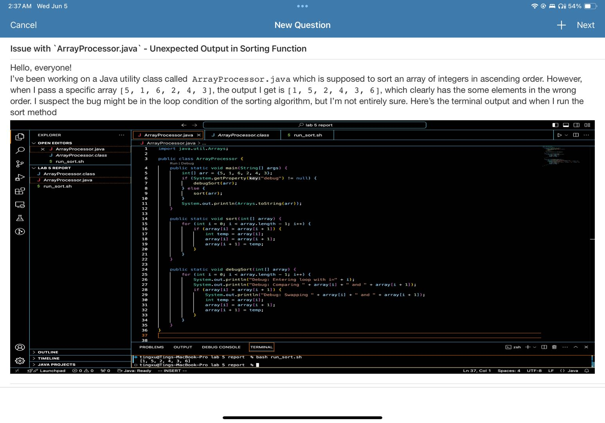

# Ting Xu's Lab Report 5

## Part 1 - Debugging Scenario

1.



2. **Response from a TA:**

   Hello, It looks like the output `[1, 5, 2, 4, 3, 6]` is showing that the sorting algorithm isn't functioning as it should. This suggests that perhaps only the initial swap operation is taking place, rather than the whole array being sorted properly.

   To address this, consider implementing a more comprehensive sorting algorithm. A simple Bubble Sort would be effective for learning purposes. This method requires multiple passes through the array, continuing until no further swaps are needed. and the command(`java -Ddebug=true ArrayProcessor` )may trace the flow of the sorting logic 

   I hope this helps solve your problem, if you have any other questions, please feel free to ask.


3


Description: The current sorting logic in my `ArrayProcessor.java` seems to perform only a single pass through the array. A single pass is insufficient for sorting the entire array unless it was nearly sorted already, which is not the case here.

4
**File & Directory Structure:**

`ArrayProcessor.java` - Contains the main sorting logic.

`run_sort.sh` - Bash script to compile and run the Java program.

**Contents of Each File Before Fixing the Bug:**

`ArrayProcessor.java`:

```ruby
import java.util.Arrays;

public class ArrayProcessor {
    public static void main(String[] args) {
        int[] arr = {5, 1, 6, 2, 4, 3};
        if (System.getProperty("debug") != null) {
            debugSort(arr);
        } else {
            sort(arr);
        }
        System.out.println(Arrays.toString(arr));
    }

    public static void sort(int[] array) {
        for (int i = 0; i < array.length - 1; i++) {
            if (array[i] > array[i + 1]) {
                int temp = array[i];
                array[i] = array[i + 1];
                array[i + 1] = temp;
            }
        }
    }

    public static void debugSort(int[] array) {
        for (int i = 0; i < array.length - 1; i++) {
            System.out.println("Debug: Entering loop with i=" + i);
            System.out.println("Debug: Comparing " + array[i] + " and " + array[i + 1]);
            if (array[i] > array[i + 1]) {
                System.out.println("Debug: Swapping " + array[i] + " and " + array[i + 1]);
                int temp = array[i];
                array[i] = array[i + 1];
                array[i + 1] = temp;
            }
        }
    }
}
```

`run_sort.sh`:

```ruby
javac ArrayProcessor.java
java ArrayProcessor
```
   
**Full Command Line to Trigger the Bug:**
```ruby

bash run_sort.sh

```

**Description of What to Edit to Fix the Bug:**

The issue is due to the sorting function only making one pass over the array. implementing a simple Bubble Sort could be a good practice, which involves multiple passes through the array until no more swaps are needed.


## Part 2 - Reflection

