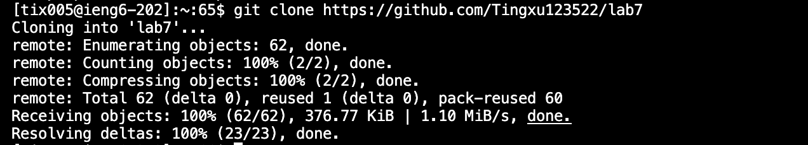
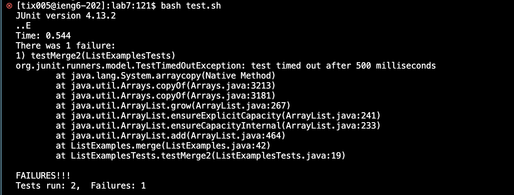
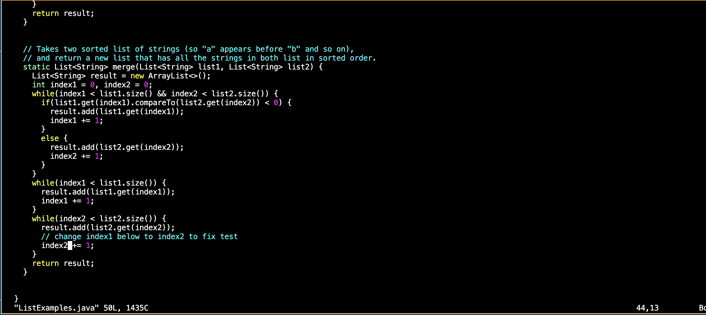
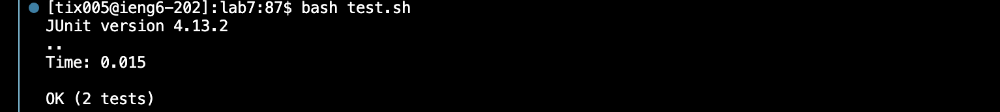
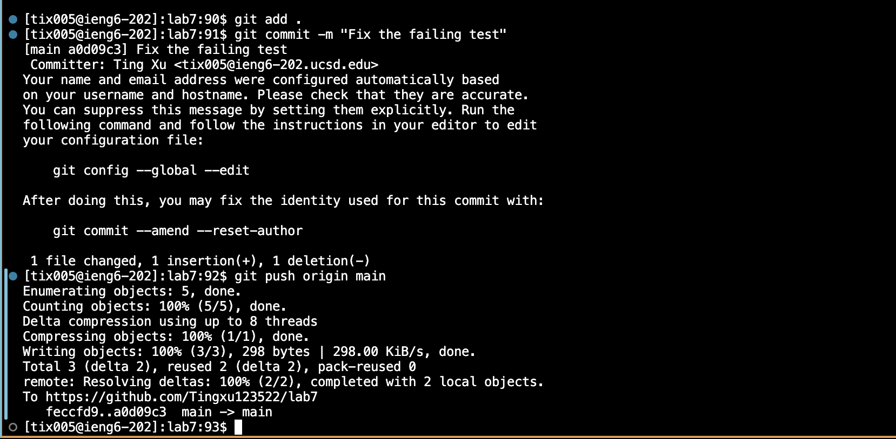
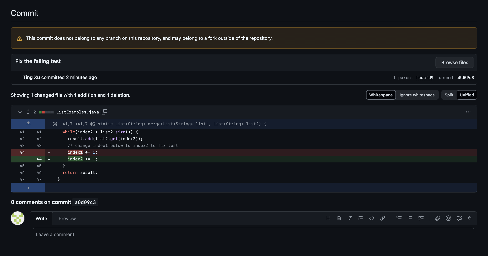

# Ting Xu's Lab Report 4

## Speeding up Command Line Tasks

## Timing Tasks

**4. Log into ieng6**

 a. command: `ssh tix005@ieng6.ucsd.edu`
 
 b. Keys pressed:: `ssh<space>tix005<@>ieng6<.>ucsd<.>edu`
 
 c. Effect: Initiates a secure connection to the server `ieng6.ucsd.edu` using the username `tix005`. This allows you to access and execute commands on the remote server.

 d. Command Summary: `SSH` is used for secure remote login to servers. By executing this command, you are authenticated and granted access to the server, provided you have the necessary permissions and credentials.

**5. Clone your fork of the repository from your Github account (using the SSH URL)**

 a. command: `git clone https://github.com/Tingxu123522/lab7`
 
 b. Keys pressed:: `git<space>clone<space>https://github.com/Tingxu123522/lab7`

 c. Effect:  Clones the repository from the provided URL into the local directory, creating a copy of the entire project history.

 d. Command Summary: The `git clone` command is used to copy a remote repository into a local workspace, allowing you to work on the project files.

**6. Run the tests, demonstrating that they fail**

 a. command: `cd lab7`
 `bash test.sh`
 
 b. Keys pressed:: `cd<space>lab7` 
  `bash<space>test<.>sh`
 
c. Effect: Navigates to the `lab7` directory and runs the `test.sh` script, which performs tests that are expected to fail initially.

d. Command Summary: Running the script with `bash test.sh` executes predefined test cases that verify the functionality of the code. Initially, these tests fail, indicating issues that need fixing.

 
     
**7. Edit the code file to fix the failing test**

 a. command: `vim ListExampls.java`
 `i`
 `delete`
 `2`
 `Esc`
`:x`
`Enter`
 
 b. Keys pressed:: `vim<space>ListExampls<.>java` `<up><up><up><up><up><up><right><right><right><right><right><right><right><right><right><right><right><right>`
 `i`
 `delete`
 `2`
`Esc`
`shift`
`;`
`x`
`Enter`

**8. Run the tests, demonstrating that they now succeed**

 a. command: `bash test.sh`
 
 b. Keys pressed:: `<up><up><enter>`

**9. Commit and push the resulting change to your Github account (you can pick any commit message!)**

 a. command: `git add .`
 `git commit -m "Fix the failing test"`
`git push origin main`
 
 b. Keys pressed:: `git<space>add<space><.>`
 `git<space>commit<space><->m<space><shift><'>Fix<space>the<space>failing<space>test<shift><'>`
 `git<space>push<space>origin<space>main`

**Command Summary:**

Up Arrow Key: When I press the `<up>` key, your terminal displays the last command you executed. Each subsequent press scrolls further back through the command history.

For instance, in this lab, we use `bash test.sh` and want to run it again without retyping the entire command, we can Press `<up>` until `bash test.sh` appears on the  command line. and then  Press `<enter>` to execute the command.

The `bash test.sh` command was 2 up in the search history, so I used the up arrow to access it quickly. This command executes the script `test.sh` which runs a series of tests defined within the bash script. Using the up arrow allowed me to rerun the script efficiently without needing to retype the command, saving time and minimizing the potential for typing errors.

