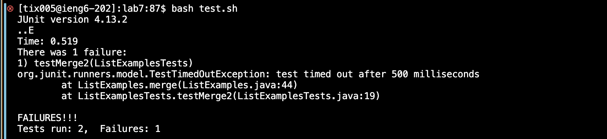
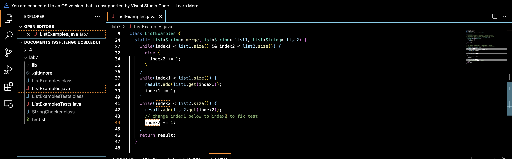

# Lab Report 4

## Speeding up Command Line Tasks

## Timing Tasks

**4. Log into ieng6**

**5. Clone your fork of the repository from your Github account (using the SSH URL)**
 

**6. Run the tests, demonstrating that they fail**

 
     
**7. Edit the code file to fix the failing test**

**8. Run the tests, demonstrating that they now succeed**

**9. Commit and push the resulting change to your Github account (you can pick any commit message!)**

