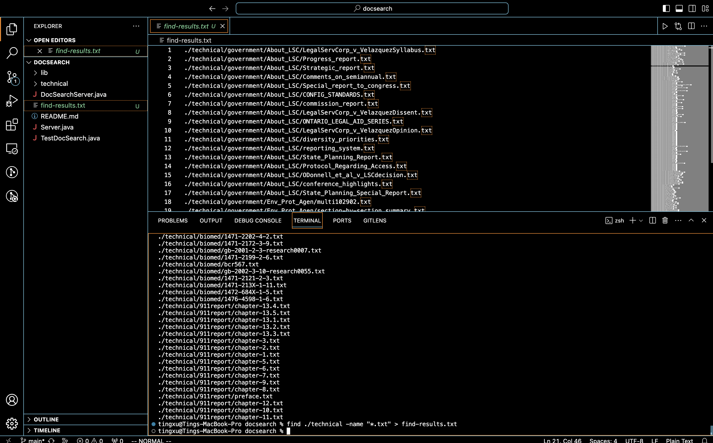

# Lab Report 4

## Speeding up Command Line Tasks


**Timing Tasks**

* 4. Log into ieng6 


* 5. Clone your fork of the repository from your Github account (using the SSH URL)
 


* 6. Run the tests, demonstrating that they fail


 
     
* 7. Edit the code file to fix the failing test


* 8. Run the tests, demonstrating that they now succeed


* 9. Commit and push the resulting change to your Github account (you can pick any commit message!)


```ruby
tingxu@Tings-MacBook-Pro docsearch % find ./technical -type d
./technical
./technical/government
./technical/government/About_LSC
./technical/government/Env_Prot_Agen
./technical/government/Alcohol_Problems
./technical/government/Gen_Account_Office
./technical/government/Post_Rate_Comm
./technical/government/Media
./technical/plos
./technical/biomed
./technical/911report
```

```ruby
tingxu@Tings-MacBook-Pro docsearch % find ./technical -type f > find-results.txt
./technical/government/About_LSC/LegalServCorp_v_VelazquezSyllabus.txt
./technical/government/About_LSC/Progress_report.txt
./technical/government/About_LSC/Strategic_report.txt
./technical/government/About_LSC/Comments_on_semiannual.txt
./technical/government/About_LSC/Special_report_to_congress.txt
./technical/government/About_LSC/CONFIG_STANDARDS.txt
./technical/government/About_LSC/commission_report.txt
./technical/government/About_LSC/LegalServCorp_v_VelazquezDissent.txt
./technical/government/About_LSC/ONTARIO_LEGAL_AID_SERIES.txt
./technical/government/About_LSC/LegalServCorp_v_VelazquezOpinion.txt
```



**Option 2: `-name:`**

The `-name:` option allows you to search for files and directories based on their names.

```ruby
tingxu@Tings-MacBook-Pro docsearch % find ./technical -name "final.txt"
./technical/government/Env_Prot_Agen/final.txt
```

```ruby
tingxu@Tings-MacBook-Pro docsearch % find ./technical -name "*.txt" > find-results.txt
./technical/government/About_LSC/LegalServCorp_v_VelazquezSyllabus.txt
./technical/government/About_LSC/Progress_report.txt
./technical/government/About_LSC/Strategic_report.txt
./technical/government/About_LSC/Comments_on_semiannual.txt
./technical/government/About_LSC/Special_report_to_congress.txt
./technical/government/About_LSC/CONFIG_STANDARDS.txt
./technical/government/About_LSC/commission_report.txt
···
