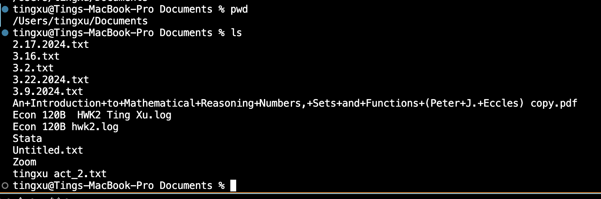

1.cd

Example1: using the command with no arguments.

Absolute Path to the working directory Before Command:  /Users/tingxu

Explanation: Running cd with no arguments returns the user to their home directory. The output doesn't show anything, but the working directory changes

Output Error: No error.

Example2: using the command with a path to a directory as an argument.

Absolute Path to the working directory Before Command: /Users/tingxu

Explanation: The cd Documents command changes the current directory to Documents. The path changes accordingly.

Output Error: No error

Example3: using the command with a path to a file as an argument.

Absolute Path to the working directory Before Command: /Users/tingxu/Documents

Explanation: cd cannot be used with a file as an argument. It is intended for changing directories, not opening files.

Output Error: Yes. This is an error because cd only works with directories.

2. ls

Example1: using the command with no arguments.

Absolute Path to the working directory Before Command: /Users/tingxu

Explanation: Lists the contents of the current working directory. If there are files and directories, they are displayed.

Output Error: No. It is the expected behavior.

Example2: using the command with a path to a directory as an argument.

Absolute Path to the working directory Before Command: /Users/tingxu

Explanation: Lists the contents of /home/username/Documents. This shows files and subdirectories inside Documents.

Output Error: No error

Example3: using the command with a path to a file as an argument.

Absolute Path to the working directory Before Command: /Users/tingxu/Documents

Explanation: this displays the file if it exists. ls can list directories or specific file names. 

Output Error: No, unless the file doesn’t exist, then it's an error.

3. cat

Example1: using the command with no arguments.

Absolute Path to the working directory Before Command: /Users/tingxu

Explanation: When executed without any arguments, cat waits for input from the standard input (stdin). After the input is provided (e.g., "Hello, World!") and terminated (usually with Ctrl+D on a new line in Unix/Linux), cat echoes the input to the standard output. This can be used for quick text entry or piping output from another command.

Output Error: No.

Example2: using the command with a path to a directory as an argument.

Absolute Path to the working directory Before Command: /Users/tingxu

Explanation: Lists the contents of /home/username/Documents. This shows files and subdirectories inside Documents.

Output Error: No error

Example3: using the command with a path to a file as an argument.

Absolute Path to the working directory Before Command: /Users/tingxu/Documents

Explanation: this displays the file if it exists. ls can list directories or specific file names. 

Output Error: No, unless the file doesn’t exist, then it's an error.

