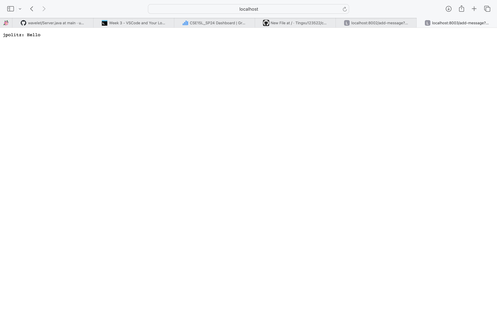
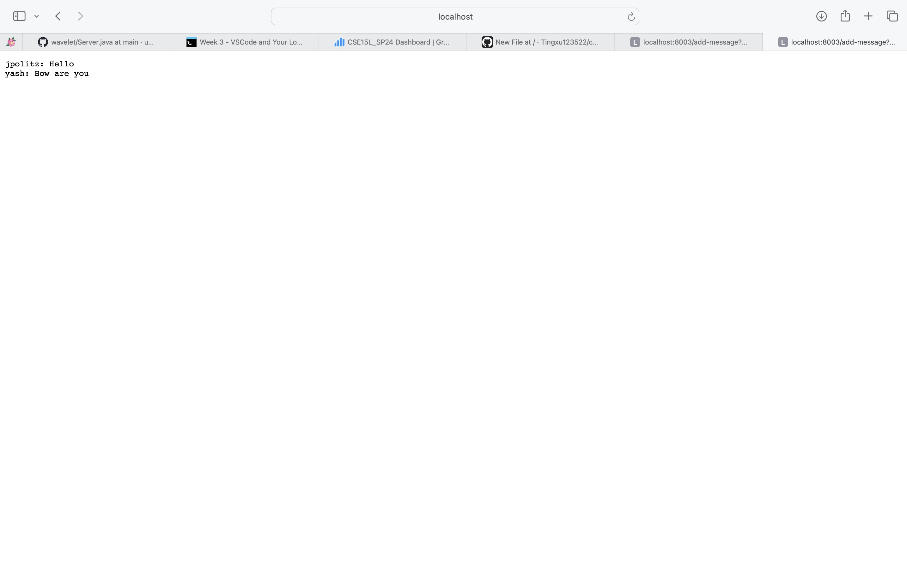
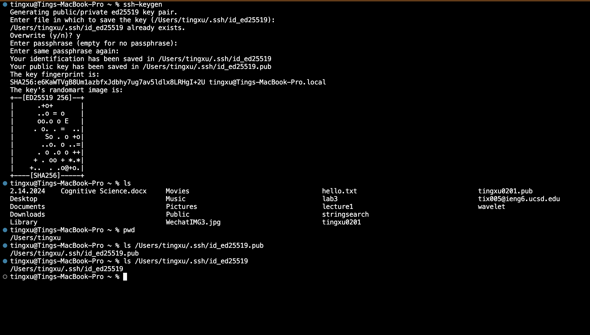
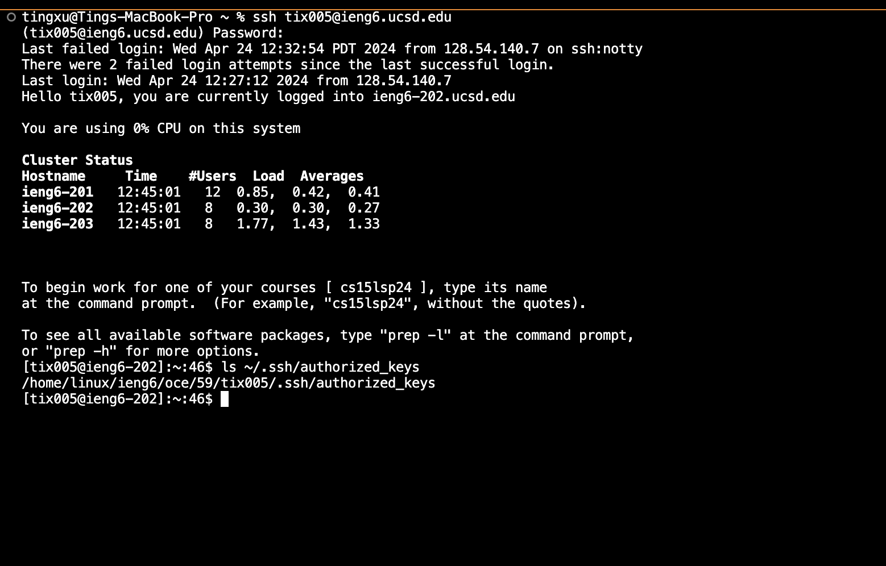
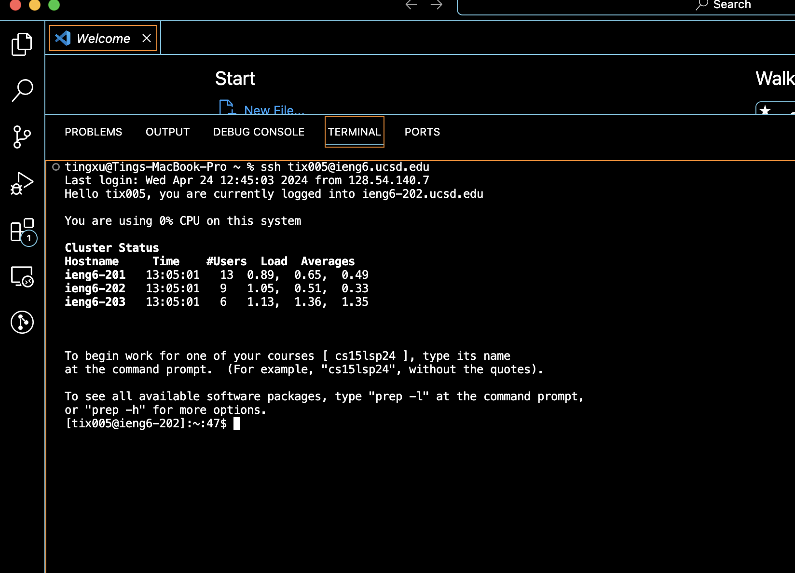

Part 1: 

The code for ChatServer:
```ruby
import java.io.IOException;
import java.io.OutputStream;
import java.net.InetSocketAddress;
import java.net.URI;
import java.util.HashMap;
import java.util.Map;

import com.sun.net.httpserver.HttpExchange;
import com.sun.net.httpserver.HttpHandler;
import com.sun.net.httpserver.HttpServer;

class ChatHandler implements HttpHandler {
    private StringBuilder chatHistory = new StringBuilder();

    @Override
    public void handle(HttpExchange exchange) throws IOException {
        if ("/add-message".equals(exchange.getRequestURI().getPath())) {
            Map<String, String> params = queryToMap(exchange.getRequestURI().getQuery());
            String user = params.get("user");
            String message = params.get("s");
            chatHistory.append(user).append(": ").append(message).append("\n");

            String response = chatHistory.toString();
            exchange.sendResponseHeaders(200, response.getBytes().length);
            OutputStream os = exchange.getResponseBody();
            os.write(response.getBytes());
            os.close();
        }
    }

    private Map<String, String> queryToMap(String query) {
        Map<String, String> result = new HashMap<>();
        for (String param : query.split("&")) {
            String[] entry = param.split("=");
            if (entry.length > 1) {
                result.put(entry[0], entry[1]);
            } else {
                result.put(entry[0], "");
            }
        }
        return result;
    }
}

public class ChatServer {
    public static void start(int port) throws IOException {
        HttpServer server = HttpServer.create(new InetSocketAddress(port), 0);
        server.createContext("/add-message", new ChatHandler());
        server.start();
        System.out.println("ChatServer Started! If on your local computer, visit http://localhost:"
+ port + "/add-message?s=<string>&user=<string>");
    }

    public static void main(String[] args) throws IOException {
        int port = 8003; 
        start(port);
    }
}


```

The screenshot of using `/add-message?s=Hello&user=jpolitz`:



a. Which methods in your code are called?

`main -> start -> handle -> queryToMap`

b. What are the relevant arguments to those methods, and the values of any relevant fields of the class?

`start`: The argument is port which is `8003`.

`handle`: The argument is exchange which represents the first `HTTP` transaction.

`queryToMap`: The argument is query which is `s=Hello&user=jpolitz`.

`chatHistory`: The value is initially an empty `StringBuilder`.

c. How do the values of any relevant fields of the class change from this specific request? If no values got changed, explain why.

`chatHistory`: The value changes from an empty `StringBuilder` to `jpolitz: Hello\n`.

The screenshot of using `/add-message?s=How are you&user=yash`:


a. Which methods in your code are called?

`handle -> queryToMap`

b. What are the relevant arguments to those methods, and the values of any relevant fields of the class?

`handle`: The argument is exchange which represents the second `HTTP` transaction.

`queryToMap`: The argument is query which is `s=How are you&user=yash`.

`chatHistory`: The value is now `jpolitz: Hello\n`.

c. How do the values of any relevant fields of the class change from this specific request? If no values got changed, explain why.

`chatHistory`: The value changes from `jpolitz: Hello\n` to `jpolitz: Hello\nyash: How are you\n`.
In both cases, the chatHistory field is updated with the new chat message in the format `<user>: <message>\n`. This is the only field that changes as a result of the requests. The change reflects the accumulation of chat messages.


Part 2:
1.


2.


3.



Part 3:
In Week 2's lab, I was introduced to the intricacies of URLs and how they are essential for locating resources on servers. I learned to remotely connect to my CSE15L account, which provided a practical understanding of accessing and interacting with a server. 

In Week 3, I gained practical experience with VSCode, enhancing my local development setup. I learned how to manage SSH keys for secure, password-less connections to remote servers. 
