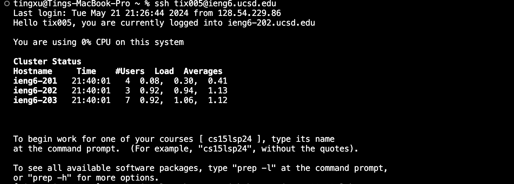

 # **lab3** 
 
## Part 1

*1. A failure-inducing input for the buggy program, as a JUnit test and any associated code (write it as a code block in Markdown).*


```ruby
import static org.junit.Assert.*;
import org.junit.*;

public class ArrayTests {
	@Test 
	public void testReverseInPlace() {
    int[] input1 = {1, 2, 3 };
    ArrayExamples.reverseInPlace(input1);
    assertArrayEquals(new int[]{ 3, 2, 1 }, input1);
    }
}
```

*2. An input that doesn't induce a failure, as a JUnit test and any associated code (write it as a code block in Markdown).*

```ruby
import static org.junit.Assert.*;
import org.junit.*;

public class ArrayTests {
   @Test
  public void testReverseInPlaceSuccess() {
      int[] input = {1, 2, 1};
      ArrayExamples.reverseInPlace(input);
      assertArrayEquals(new int[]{1, 2, 1}, input);
  }
}
```

*3. The symptom, as the output of running the two tests above (provide it as a screenshot -- one test should pass, one test should fail).*



*4. The bug, as the before-and-after code change required to fix it (as two code blocks in Markdown).*

**Before Code Change:**

```ruby
public class ArrayExamples {
    static void reverseInPlace(int[] arr) {
        for (int i = 0; i < arr.length; i += 1) {
            arr[i] = arr[arr.length - i - 1];
        }
    }
}
```

**After Code Change:**
```ruby
public class ArrayExamples {
    static void reverseInPlace(int[] arr) {
        for (int i = 0; i < arr.length / 2; i += 1) {
            int temp = arr[i];
            arr[i] = arr[arr.length - i - 1];
            arr[arr.length - i - 1] = temp;
        }
    }
}
```

*5. Briefly describe (2-3 sentences) why the fix addresses the issue.*

The fix addresses the issue by swapping elements correctly only up to the halfway point (`arr.length / 2`). The original code overwrote elements incorrectly, resulting in a failure when reversing an odd-length array. The corrected code now uses a temporary variable to hold the current element being swapped, ensuring proper element swapping.

## Part 2

**Find**

**Option 1:** `-type`: 

The `-type` option allows you to specify the type of file you're searching for. The common types are `f` for regular files, `d` for directories, and `l`for symbolic links.

```ruby
$ find ./technical -type d
./technical
./technical/plos
./technical/911report
./technical/government
```

```ruby
$ find ./technical -type f
./technical/biomed/file2.txt
./technical/plos/file0.txt
./technical/plos/file1.txt
./technical/plos/file2.txt
./technical/911report/chapter-1.txt
```

**Option 2: `-name:`**

The `-name:` option allows you to search for files and directories based on their names.

```ruby
$ find ./technical -name "file1.txt"
./technical/plos/file1.txt
```

```ruby
$ find ./technical -name "*.txt"
./technical/biomed/file2.txt
./technical/plos/file0.txt
./technical/plos/file1.txt
./technical/plos/file2.txt
```

**Option 3: `-size`:**

The `-size` option allows you to search for files based on their size. The size can be specified in blocks (`b`), bytes (`c`), kilobytes (`k`), megabytes (`M`), or gigabytes (`G`).

```ruby
$ find ./technical -size +1k
./technical/biomed/file2.txt
./technical/911report/chapter-1.txt
./technical/government/About_LSC.txt
```

```ruby
$ find ./technical -size -1k
./technical/plos/file0.txt
./technical/plos/file1.txt
```

**Option 4: `-mtime`:**

The `-mtime` option allows you to search for files based on the modification time. The time is specified in days.

```ruby
$ find ./technical -mtime -7
./technical/plos/file2.txt
```

```ruby
$ find ./technical -mtime +30
./technical/biomed/file2.txt
./technical/plos/file0.txt
./technical/plos/file1.txt
./technical/911report/chapter-1.txt
```

Source:
1.Chat


