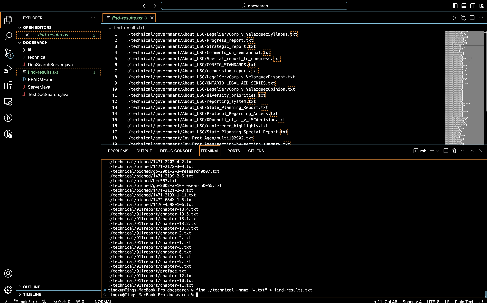

 # **Lab Report 3** 
 
## Part 1

*1. A failure-inducing input for the buggy program, as a JUnit test and any associated code (write it as a code block in Markdown).*


```ruby
import static org.junit.Assert.*;
import org.junit.*;

public class ArrayTests {
	@Test 
	public void testReverseInPlace() {
    int[] input1 = {1, 2, 3 };
    ArrayExamples.reverseInPlace(input1);
    assertArrayEquals(new int[]{ 3, 2, 1 }, input1);
    }
}
```

*2. An input that doesn't induce a failure, as a JUnit test and any associated code (write it as a code block in Markdown).*

```ruby
import static org.junit.Assert.*;
import org.junit.*;

public class ArrayTests {
   @Test
  public void testReverseInPlaceSuccess() {
      int[] input = {1, 2, 1};
      ArrayExamples.reverseInPlace(input);
      assertArrayEquals(new int[]{1, 2, 1}, input);
  }
}
```

*3. The symptom, as the output of running the two tests above (provide it as a screenshot -- one test should pass, one test should fail).*


*4. The bug, as the before-and-after code change required to fix it (as two code blocks in Markdown).*

**Before Code Change:**

```ruby
public class ArrayExamples {
    static void reverseInPlace(int[] arr) {
        for (int i = 0; i < arr.length; i += 1) {
            arr[i] = arr[arr.length - i - 1];
        }
    }
}
```

**After Code Change:**
```ruby
public class ArrayExamples {
    static void reverseInPlace(int[] arr) {
        for (int i = 0; i < arr.length / 2; i += 1) {
            int temp = arr[i];
            arr[i] = arr[arr.length - i - 1];
            arr[arr.length - i - 1] = temp;
        }
    }
}
```

*5. Briefly describe (2-3 sentences) why the fix addresses the issue.*

The fix addresses the issue by swapping elements correctly only up to the halfway point (`arr.length / 2`). The original code overwrote elements incorrectly, resulting in a failure when reversing an odd-length array. The corrected code now uses a temporary variable to hold the current element being swapped, ensuring proper element swapping.

## Part 2

**Find**

**Option 1:** `-type`: 

The `-type` option allows you to specify the type of file you're searching for. The common types are `f` for regular files, `d` for directories, and `l`for symbolic links.

```ruby
tingxu@Tings-MacBook-Pro docsearch % find ./technical -type d
./technical
./technical/government
./technical/government/About_LSC
./technical/government/Env_Prot_Agen
./technical/government/Alcohol_Problems
./technical/government/Gen_Account_Office
./technical/government/Post_Rate_Comm
./technical/government/Media
./technical/plos
./technical/biomed
./technical/911report
```

```ruby
tingxu@Tings-MacBook-Pro docsearch % find ./technical -type f > find-results.txt
./technical/government/About_LSC/LegalServCorp_v_VelazquezSyllabus.txt
./technical/government/About_LSC/Progress_report.txt
./technical/government/About_LSC/Strategic_report.txt
./technical/government/About_LSC/Comments_on_semiannual.txt
./technical/government/About_LSC/Special_report_to_congress.txt
./technical/government/About_LSC/CONFIG_STANDARDS.txt
./technical/government/About_LSC/commission_report.txt
./technical/government/About_LSC/LegalServCorp_v_VelazquezDissent.txt
./technical/government/About_LSC/ONTARIO_LEGAL_AID_SERIES.txt
./technical/government/About_LSC/LegalServCorp_v_VelazquezOpinion.txt
./technical/government/About_LSC/diversity_priorities.txt
./technical/government/About_LSC/reporting_system.txt
```



**Option 2: `-name:`**

The `-name:` option allows you to search for files and directories based on their names.

```ruby
tingxu@Tings-MacBook-Pro docsearch % find ./technical -name "final.txt"
./technical/government/Env_Prot_Agen/final.txt
```

```ruby
tingxu@Tings-MacBook-Pro docsearch % find ./technical -name "*.txt" > find-results.txt
./technical/government/About_LSC/LegalServCorp_v_VelazquezSyllabus.txt
./technical/government/About_LSC/Progress_report.txt
./technical/government/About_LSC/Strategic_report.txt
./technical/government/About_LSC/Comments_on_semiannual.txt
./technical/government/About_LSC/Special_report_to_congress.txt
./technical/government/About_LSC/CONFIG_STANDARDS.txt
./technical/government/About_LSC/commission_report.txt
```

**Option 3: `-size`:**

The `-size` option allows you to search for files based on their size. The size can be specified in blocks (`b`), bytes (`c`), kilobytes (`k`), megabytes (`M`), or gigabytes (`G`).

```ruby
tingxu@Tings-MacBook-Pro docsearch % find ./technical -size +200k
./technical/government/About_LSC/commission_report.txt
./technical/government/Env_Prot_Agen/bill.txt
./technical/government/Gen_Account_Office/GovernmentAuditingStandards_yb2002ed.txt
./technical/government/Gen_Account_Office/Statements_Feb28-1997_volume.txt
./technical/government/Gen_Account_Office/d01591sp.txt
./technical/911report/chapter-13.4.txt
./technical/911report/chapter-13.5.txt
./technical/911report/chapter-3.txt
```

```ruby
$ tingxu@Tings-MacBook-Pro docsearch % find ./technical -size -1000c
./technical
./technical/government
./technical/government/About_LSC
./technical/government/Env_Prot_Agen
./technical/government/Alcohol_Problems
./technical/government/Post_Rate_Comm
./technical/plos/pmed.0020191.txt
./technical/plos/pmed.0020226.txt
./technical/911report
```

**Option 4: `-mtime`:**

The `-mtime` option allows you to search for files based on the modification time. The time is specified in days.

```ruby
tingxu@Tings-MacBook-Pro docsearch % find ./technical -mtime -7
./technical/government/About_LSC/LegalServCorp_v_VelazquezSyllabus.txt
./technical/government/About_LSC/Progress_report.txt
./technical/government/About_LSC/Strategic_report.txt
./technical/government/About_LSC/Comments_on_semiannual.txt
./technical/government/About_LSC/Special_report_to_congress.txt
./technical/government/About_LSC/CONFIG_STANDARDS.txt
./technical/government/About_LSC/commission_report.txt
./technical/government/About_LSC/LegalServCorp_v_VelazquezDissent.txt
./technical/government/About_LSC/ONTARIO_LEGAL_AID_SERIES.txt
./technical/government/About_LSC/LegalServCorp_v_VelazquezOpinion.txt
```

```ruby
tingxu@Tings-MacBook-Pro docsearch % find ./technical -mtime -30
./technical/government/About_LSC/LegalServCorp_v_VelazquezSyllabus.txt
./technical/government/About_LSC/Progress_report.txt
./technical/government/About_LSC/Strategic_report.txt
./technical/government/About_LSC/Comments_on_semiannual.txt
./technical/government/About_LSC/Special_report_to_congress.txt
./technical/government/About_LSC/CONFIG_STANDARDS.txt
./technical/government/About_LSC/commission_report.txt
./technical/government/About_LSC/LegalServCorp_v_VelazquezDissent.txt
./technical/government/About_LSC/ONTARIO_LEGAL_AID_SERIES.txt
./technical/government/About_LSC/LegalServCorp_v_VelazquezOpinion.txt
```

# Source:
1. How to Find a File in Linux | Find Command: https://www.geeksforgeeks.org/find-command-in-linux-with-examples/,
2. 10 ways to use the Linux find command: https://www.redhat.com/sysadmin/linux-find-command
3. 15 Super Useful Examples of Find Command in Linux: https://linuxhandbook.com/find-command-examples/
4. ChatGPT


## ChatGPT
At first, I used ChatGPT to find an introduction and examples of the `find` command, and since we need 2 examples of using this command with . Files and directories in /technical, so I ran the command using my computer and copied the output to this document, during this process I had some difficulties, especially with using the time to find the files, because the time was too close, within 1 day, so the results for the last 1 day and the last 30 days were the same.


